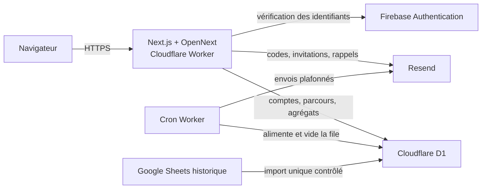

# Conception technique V1 — plateforme alumni

> Statut : conception proposée à implémenter.
>
> Décisions produit de référence : [PRODUCT_DISCOVERY.md](./PRODUCT_DISCOVERY.md).

## 1. Résumé exécutable

La V1 conserve Next.js sur Cloudflare Workers avec OpenNext. Une nouvelle base
D1 unifie les comptes métier, profils, parcours, statistiques, administration
et idées. Firebase Authentication vérifie les mots de passe ; Resend sert à
l’activation et aux emails applicatifs. L’application émet ensuite sa propre
session opaque, révocable et conservée dans un cookie sécurisé.

Les anciennes réponses sont importées de façon anonyme et restent séparées des
relevés actuels. L’explorateur ne reçoit que des agrégats et masque tout segment
comptant moins de trois alumni distincts.

## 2. Architecture cible



Responsabilités :

- Firebase ne connaît que l’identité de connexion.
- D1 décide si le compte est autorisé, actif, suspendu ou supprimé.
- Resend ne constitue jamais une source de vérité.
- Le navigateur ne détient ni JWT métier durable ni donnée salariale brute
  appartenant à un autre alumni.

Les décisions structurantes sont consignées dans
[ADR 0001](./adr/0001-d1-source-de-verite.md) et
[ADR 0002](./adr/0002-firebase-identifiants-sessions-d1.md).

## 3. Modèle D1

Le schéma exécutable se trouve dans `migrations/`. Les identifiants applicatifs
sont des chaînes opaques générées côté serveur. Les montants monétaires sont
des entiers dans l’unité mineure de la devise ; les pourcentages et taux sont
des entiers mis à l’échelle. Les dates métier utilisent `YYYY-MM-DD` et les
dates techniques l’UTC ISO 8601.

### 3.1 Identité et accès

- `account` : une ligne dès l’import de la whitelist, même avant activation.
  L’email normalisé est unique ; `firebase_uid` est ajouté après activation.
- `user_session` : empreinte SHA-256 du jeton opaque, dernière activité,
  expiration et révocation.
- `verification_challenge` : empreinte du code Resend, but, durée et compteur
  d’essais. Aucun code en clair n’est persisté.
- `alumni_profile` : diplôme, spécialité et préférences.
- `directory_consent` : opt-in global puis visibilité champ par champ.

### 3.2 Parcours professionnel

- `professional_activity` représente une relation professionnelle continue.
  Un changement d’employeur ou de métier clôt l’activité et en ouvre une autre.
- `situation_snapshot` représente la rémunération et les conditions à une date.
  Une modification salariale ajoute un relevé sans dupliquer l’activité.
- `activity_confirmation` enregistre la confirmation « rien n’a changé » sans
  créer un faux relevé.
- `snapshot_benefit` contient les avantages et leur valeur structurée.

Une personne peut avoir plusieurs activités simultanées, mais une seule activité
principale ouverte. Cette règle est vérifiée dans la transaction applicative,
car un index partiel ne suffit pas à exprimer toutes les transitions datées.

### 3.3 Taxonomies

`taxonomy_category` porte les domaines, métiers, secteurs et avantages.
`taxonomy_alias` contient les formulations reconnues. Une saisie « autre »
crée une `taxonomy_proposal` et conserve le texte original. Une correspondance
approximative est proposée à l’utilisateur mais n’est jamais appliquée
silencieusement. Toute requalification est journalisée et réversible.

### 3.4 Données historiques

`import_batch` mémorise la source, son empreinte SHA-256 et les compteurs de
contrôle. `legacy_survey_response` conserve une copie anonyme des anciennes
réponses, leurs libellés bruts et leurs normalisations. Cette table ne possède
aucune clé vers `account`.

### 3.5 Suppression

Les activités et relevés identifiables sont supprimés en cascade avec le
compte. Avant suppression, les seules contributions utiles qui peuvent être
conservées sont généralisées dans `anonymous_contribution` :

- nouvel identifiant aléatoire sans table de correspondance ;
- dates réduites au mois ou à l’année ;
- géographie, effectif et métier ramenés à des catégories ;
- rémunération convertie en tranche ;
- aucune donnée libre, employeur, ville ou intitulé.

Ces contributions deviennent exclusivement historiques. Si l’anonymisation
irréversible n’est pas possible, la contribution est supprimée. La procédure
doit être validée juridiquement avant mise en production.

## 4. Invariants et transactions

Les opérations suivantes utilisent `D1Database.batch()`, dont l’échec annule le
lot :

- création d’un relevé, de ses avantages et de son journal ;
- définition d’une nouvelle activité principale et retrait de l’ancienne ;
- vote d’une idée et mise à jour de son compteur ;
- réservation d’un email puis transition vers `sending` ;
- traitement d’une suppression et révocation des sessions.

Invariants principaux :

1. une requête métier part toujours de l’identifiant de compte de la session ;
2. un compte suspendu ou supprimé ne peut plus utiliser une session existante ;
3. un relevé appartient à une activité appartenant au compte courant ;
4. `observed_on` est modifiable, `recorded_at` ne l’est pas ;
5. une confirmation ne modifie aucune valeur du relevé ;
6. les montants originaux ne sont jamais écrasés par leur conversion ;
7. les anciennes réponses ne deviennent jamais des données « actuelles » ;
8. les traitements email sont idempotents grâce à une clé unique.

## 5. Authentification et sessions

### 5.1 Première activation

1. `POST /api/auth/activation/request` reçoit l’email et un jeton Turnstile.
2. La réponse reste identique que l’adresse soit ou non autorisée.
3. Pour un compte éligible, le serveur crée un code à six chiffres, ne stocke
   que son empreinte et programme l’email Resend.
4. `POST /api/auth/activation/verify` consomme le code à usage unique.
5. Le navigateur choisit son mot de passe ; Firebase crée l’identifiant.
6. Le serveur vérifie le jeton Firebase, associe le `firebase_uid`, active le
   compte D1 et crée la session applicative.

Le code expire après dix minutes. Les demandes sont limitées par adresse et par
empreinte réseau éphémère ; les tentatives sont plafonnées.

### 5.2 Connexions suivantes

`POST /api/auth/login` échange email et mot de passe avec Firebase côté serveur,
valide le compte D1, puis émet un jeton aléatoire d’au moins 256 bits. D1 ne
conserve que `SHA-256(jeton)`.

Cookie :

```text
__Host-alumni_session=<opaque>; Path=/; HttpOnly; Secure; SameSite=Lax
```

L’expiration est glissante, quinze mois après la dernière activité. La date
`last_seen_at` n’est écrite qu’une fois par fenêtre (par exemple 24 heures) pour
éviter une écriture D1 à chaque navigation. Déconnexion, suspension et
suppression révoquent les sessions concernées.

Les changements d’email, la suppression et l’administration exigent une
réauthentification Firebase récente. Un contrôle CSRF par origine et jeton est
appliqué aux mutations, en complément de `SameSite`.

## 6. Contrats d’API

Toutes les réponses d’erreur suivent :

```json
{
  "error": {
    "code": "stable_machine_code",
    "message": "Message compréhensible",
    "requestId": "opaque"
  }
}
```

### 6.1 Session et profil

| Méthode | Route | Usage |
|---|---|---|
| POST | `/api/auth/activation/request` | Demander le code initial |
| POST | `/api/auth/activation/verify` | Vérifier le code |
| POST | `/api/auth/login` | Créer une session D1 après Firebase |
| POST | `/api/auth/logout` | Révoquer la session courante |
| POST | `/api/auth/logout-all` | Révoquer toutes les sessions |
| GET | `/api/auth/session` | Compte courant et capacités |
| GET, PATCH | `/api/profile` | Lire ou modifier le profil |
| GET, PUT | `/api/profile/directory-consent` | Consentements d’annuaire |
| GET | `/api/profile/sessions` | Appareils et dernières activités |
| DELETE | `/api/profile/sessions/:id` | Fermer une autre session |

### 6.2 Activités et relevés

| Méthode | Route | Usage |
|---|---|---|
| GET, POST | `/api/activities` | Lister ou créer une activité |
| GET, PATCH | `/api/activities/:id` | Lire ou corriger l’activité |
| POST | `/api/activities/:id/close` | Clôturer une activité |
| GET, POST | `/api/activities/:id/snapshots` | Historique ou nouveau relevé |
| PATCH | `/api/snapshots/:id` | Corriger un relevé |
| POST | `/api/activities/:id/confirm` | Confirmer la situation |
| GET | `/api/taxonomies` | Catégories actives et alias |
| POST | `/api/taxonomy-proposals` | Soumettre une valeur « autre » |

La création d’un relevé accepte les valeurs originales et renvoie aussi les
valeurs normalisées calculées. Les schémas d’entrée refusent les champs inconnus
pour éviter les affectations de masse.

### 6.3 Restitution

| Méthode | Route | Usage |
|---|---|---|
| GET | `/api/cockpit` | Situation et comparaisons personnelles |
| POST | `/api/explorer/query` | Agrégats filtrés |
| GET | `/api/explorer/options` | Filtres disponibles et compteurs sûrs |

`/api/explorer/query` accepte une liste blanche de dimensions, périodes et
mesures. La réponse contient `sampleSize`, médiane, moyenne arrondie,
rémunération totale et évolution, ou `suppressed: true`. Aucun tableau de
relevés individuels n’est renvoyé.

### 6.4 Idées et administration

Les routes d’idées passent de l’email fourni par le client à l’identifiant issu
de la session. L’auteur devient nullable lors d’une suppression, avec la
mention « Ancien membre » ; ses votes sont supprimés.

Les routes `/api/admin/**` exigent le rôle D1 `admin` et une réauthentification
récente. Elles couvrent comptes, invitations, rappels, taxonomies, demandes de
suppression et journal d’audit. Une route admin ne renvoie jamais un salaire
individuel.

## 7. Confidentialité des statistiques

Le seuil minimal est :

```sql
HAVING COUNT(DISTINCT account_id) >= 3
```

Il doit être appliqué après tous les filtres, et non sur le nombre de relevés.
Pour réduire les attaques par différence malgré ce seuil :

- dimensions et combinaisons de filtres limitées ;
- dates, expérience, effectifs et géographies présentés par tranches fixes ;
- montants agrégés arrondis, par exemple aux 500 euros ;
- facettes rares masquées ;
- un seul relevé pertinent par alumni et segment ;
- limitation de débit et journalisation des requêtes atypiques ;
- en-têtes `Cache-Control: private, no-store`.

Le seuil de trois protège l’affichage nominal du produit, mais ne constitue pas
à lui seul une anonymisation juridique.

## 8. Emails et tâches planifiées

Un worker personnalisé enveloppe le handler OpenNext et ajoute un gestionnaire
`scheduled`. Un déclencheur quotidien UTC suffit au départ.

À chaque passage :

1. matérialiser les invitations et rappels arrivés à échéance ;
2. calculer le quota fournisseur restant ;
3. réserver la marge configurée pour activation et récupération ;
4. sélectionner un petit lot priorisé et verrouillé par statut ;
5. envoyer via Resend puis journaliser succès ou échec ;
6. replanifier les échecs transitoires avec backoff.

`email_configuration` définit les échéances, la pause et les plafonds distincts
des invitations et rappels. Une clé d’idempotence empêche le double envoi. La
page admin affiche les emails éligibles, futurs, envoyés et échoués, sans
validation manuelle des lots.

## 9. Migration

### Phase A — Préparation

1. Créer `alumni_db` et le binding `DB`, sans modifier `IDEAS_DB`.
2. Appliquer les migrations en local, preview puis production.
3. Sauvegarder la base idées et exporter les sources historiques.
4. Importer la whitelist sous forme de comptes `eligible`.

### Phase B — Reprise

1. Importer les idées en associant les emails normalisés aux comptes.
2. Importer les votes ; isoler les emails absents de la whitelist dans le
   rapport au lieu d’inventer un compte.
3. Importer le sondage historique avec identifiant de lot, empreinte du fichier,
   taxonomies et valeurs brutes.
4. Comparer effectifs, distributions et statistiques avec l’application
   actuelle.

### Phase C — Bascule

1. Déployer l’authentification Firebase et les sessions D1.
2. Faire une courte période de double lecture uniquement pour la recette.
3. Basculer cockpit, explorateur et idées vers `DB`.
4. Retirer le mot de passe global, les JWT en `localStorage` et la lecture
   Google Sheets.
5. Conserver l’ancienne base et le Sheet en lecture seule pendant la période de
   retour arrière, puis supprimer les secrets devenus inutiles.

Les migrations D1 restent additives pendant le déploiement. Une restauration
Time Travel est disponible sept jours sur l’offre gratuite ; un export avant
bascule demeure nécessaire.

## 10. Ordre d’implémentation

1. **Fondations** — migrations, types, dépôts D1, transactions et audit.
2. **Accès** — Firebase, activation Resend, Turnstile, cookie et sessions.
3. **Contribution** — profil, activités, relevés, avantages et confirmations.
4. **Reprise** — import reproductible, rapport et comparaison des agrégats.
5. **Restitution** — cockpit puis explorateur avec tests de confidentialité.
6. **Administration** — comptes, invitations, rappels, quotas et taxonomies.
7. **Idées** — nouvelle page et migration email vers identifiant de compte.
8. **Durcissement** — suppression, réauthentification, limites, observabilité,
   sauvegarde et recette de bascule.

Chaque tranche doit inclure tests unitaires, tests d’intégration D1 local et
tests d’autorisation. Les tests de statistiques doivent couvrir explicitement
2, 3, 7 et 8 alumni distincts, les historiques multiples d’une même personne
et les attaques par filtres voisins.

## 11. Configuration à prévoir

La configuration cible ajoute :

- binding D1 `DB` vers la nouvelle base ;
- secrets Firebase serveur ;
- clé Resend ;
- secret de pepper pour codes et sessions ;
- clés Turnstile ;
- déclencheur cron UTC ;
- worker OpenNext personnalisé avec `fetch` et `scheduled`.

Les identifiants de ressources de production ne doivent pas être inventés dans
le dépôt. Ils sont ajoutés après création effective des ressources.

## 12. Limites gratuites vérifiées

Au 30 juillet 2026 :

- Workers Free : 100 000 requêtes par jour, 10 ms de CPU par requête, 128 Mo et
  jusqu’à cinq déclencheurs cron ;
- D1 Free : 5 millions de lignes lues et 100 000 écrites par jour, 5 Go au
  total, 500 Mo par base et 50 requêtes par invocation ;
- Firebase Authentication Spark : jusqu’à 3 000 utilisateurs actifs quotidiens
  pour les fournisseurs d’identité de niveau 1.

Ces plafonds sont suffisants pour le lancement visé, sous réserve de surveiller
la taille des agrégations et le quota email Resend.

Sources officielles :

- [Limites Cloudflare Workers](https://developers.cloudflare.com/workers/platform/limits/)
- [Limites Cloudflare D1](https://developers.cloudflare.com/d1/platform/limits/)
- [API et transactions D1](https://developers.cloudflare.com/d1/worker-api/d1-database/)
- [Migrations D1](https://developers.cloudflare.com/d1/reference/migrations/)
- [Time Travel D1](https://developers.cloudflare.com/d1/reference/time-travel/)
- [Cron Triggers](https://developers.cloudflare.com/workers/configuration/cron-triggers/)
- [Worker personnalisé OpenNext](https://opennext.js.org/cloudflare/howtos/custom-worker)
- [Validation serveur Turnstile](https://developers.cloudflare.com/turnstile/get-started/server-side-validation/)
- [Firebase Authentication](https://firebase.google.com/docs/auth)

## 13. Points à valider avant développement

- validation juridique de la politique d’anonymisation après suppression ;
- domaine expéditeur Resend et adresse de réponse ;
- régions et devises réellement attendues au lancement ;
- durée exacte de la période de retour arrière ;
- liste définitive des administrateurs initiaux.
